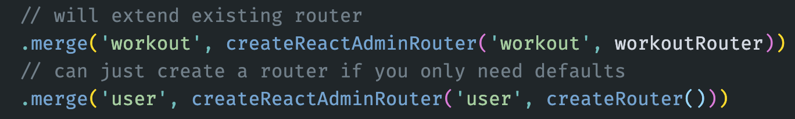
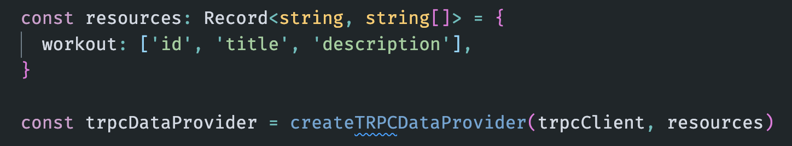
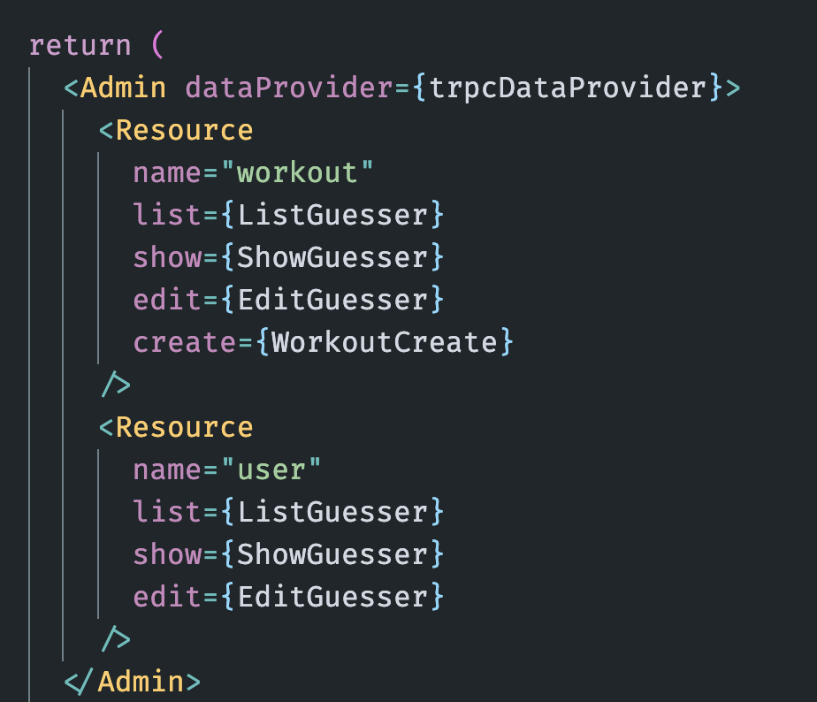
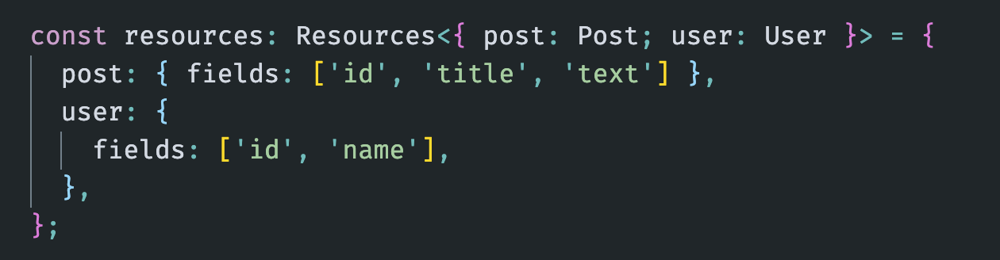

# ra-trpc

This is a React-Admin compatible DataProvider and server route creator for using react-admin with tRPC. This is very much a WIP and help is greatly appreciated.

## Install

`yarn add ra-trpc`

## Usage

This package currently exposes two modules: `ra-trpc/server` and `ra-trpc/client`.

### Server

Import the server router generator with:

`import { createReactAdminRouter } from 'ra-trpc/server'`

You can use the function to extend a router that already exists with the defaults needed for usage with react-admin.

### Client

Import the data provider creator with:

`import { createTRPCDataProvider } from 'ra-trpc/client'`

It takes a TRPC client and a set of resources. The resources allow you to choose what fields will be fetched for the resource.

> This currently only applies to the `list` and `getOne` operations.

### React Admin

The routers and data provider on the client should align with the resource names used in the React Admin `Resource` components.

There's a `Resources` utility type you can use to provide a mapping.

